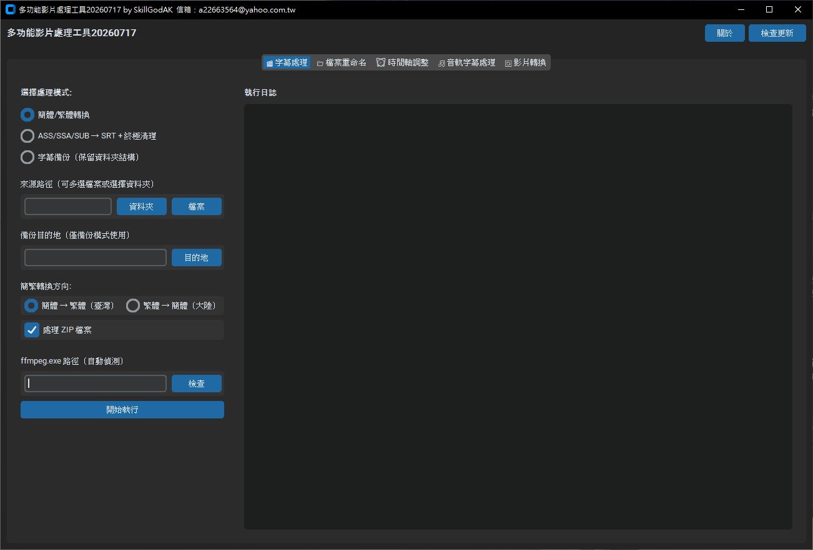
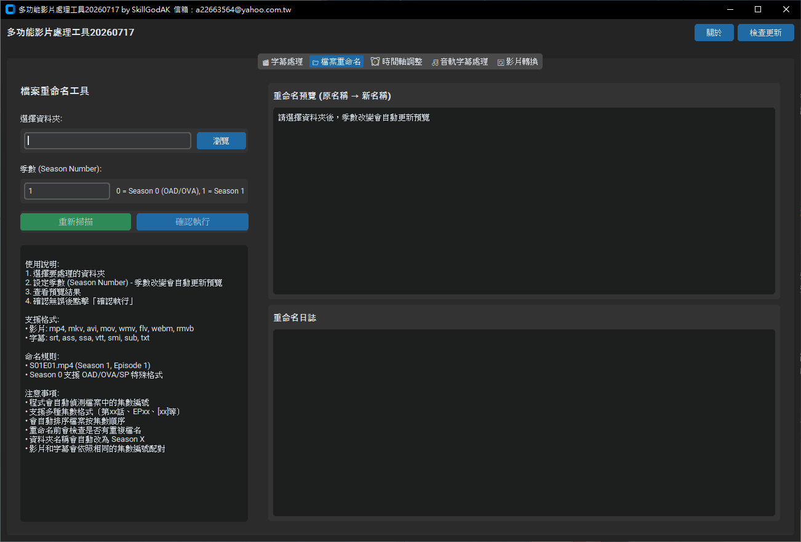
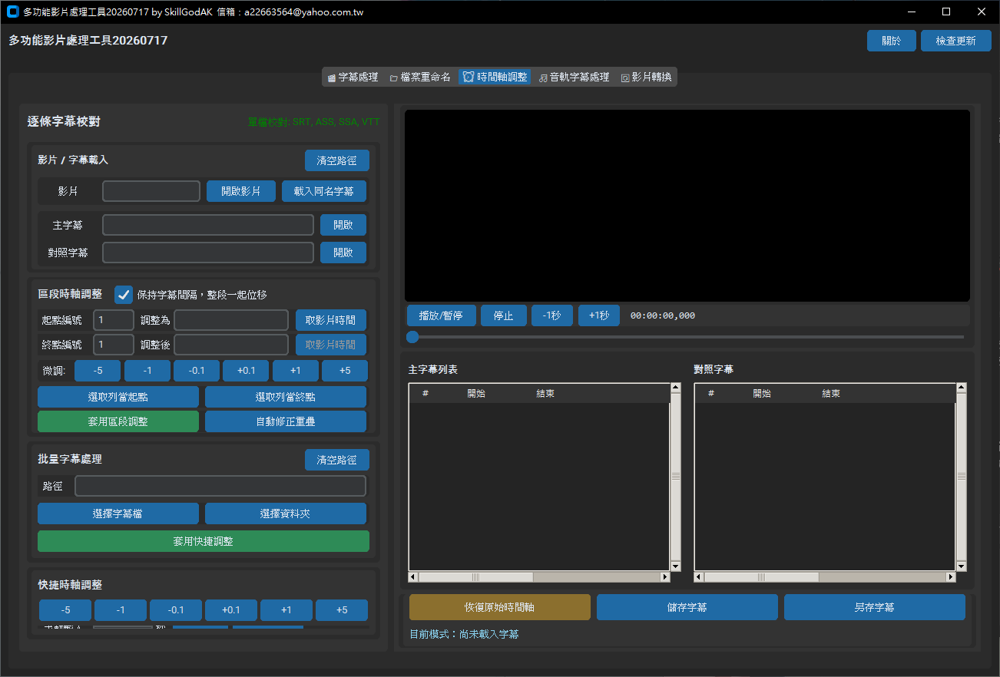
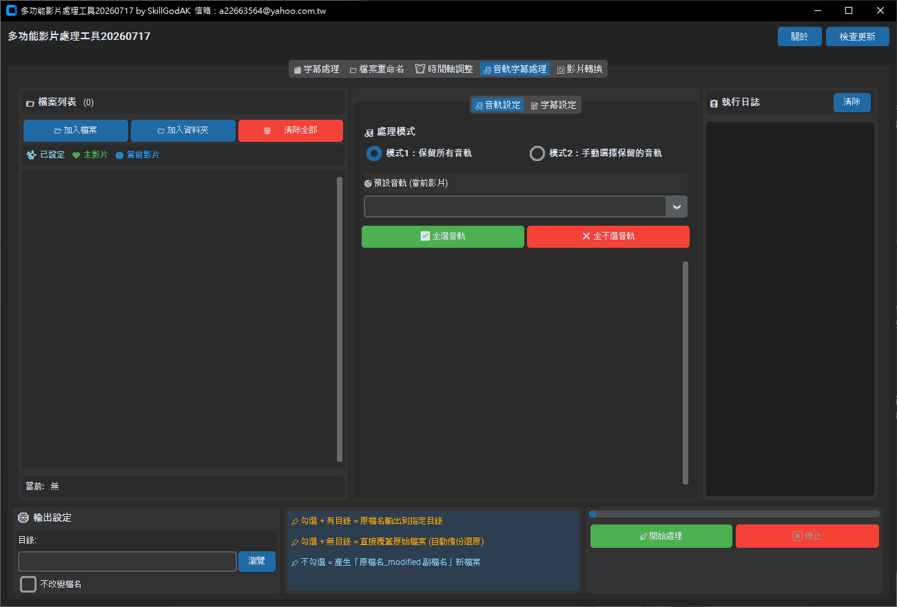
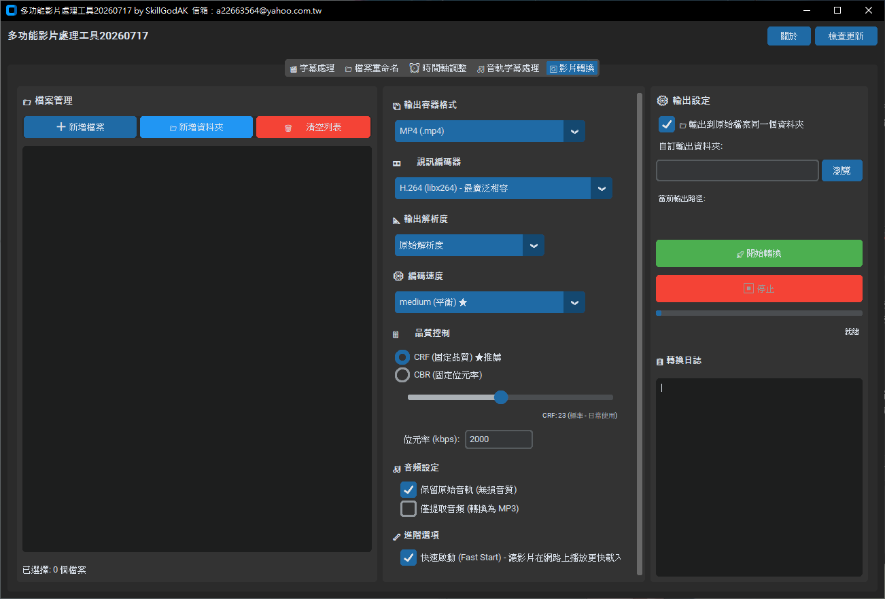

# 多功能影片處理工具

Windows 影片、字幕與檔案整理工具，將常用處理功能集中在同一個程式內完成。

[下載最新正式版](https://github.com/SkillGodAk/multi-function-video-tool/releases/latest) ｜ [查看版本更新內容](https://github.com/SkillGodAk/multi-function-video-tool/releases)

## 功能介紹

### 字幕處理

- 簡體中文與繁體中文互相轉換。
- ASS、SSA、SUB 轉換為 SRT，並清理字幕樣式。
- 支援單一檔案、資料夾與 ZIP 批次處理。
- 字幕檔案集中備份並保留原有資料夾結構。

### 智能重新命名

- 自動辨識影片與字幕的季數、集數。
- 統一輸出為 `SxxExx` 命名格式。
- 支援 `v2`、`repack` 等修正版標記判斷。
- 執行前提供完整預覽，並避免重複檔名覆蓋。

### 字幕時間軸調整

- 批次提前或延後 SRT、ASS、SSA、VTT 字幕時間。
- 支援影片預覽、逐條校對與區段調整。
- 可直接覆蓋、另存新檔或輸出到指定資料夾。

### 音軌與字幕管理

- 選擇要保留或移除的音軌與內嵌字幕。
- 設定預設音軌與預設字幕。
- 支援多檔案獨立設定與主從同步設定。
- 可保留原始檔名、直接覆蓋或輸出新檔案。

### 影片格式轉換

- 支援常見影片、音訊格式與多種編碼器。
- 整合 FFmpeg 與 FFprobe，不需另外安裝。
- 支援硬體加速、輸出品質與音訊參數設定。
- 提供批次轉換、進度顯示與停止功能。

## 下載

請從 [GitHub Releases](https://github.com/SkillGodAk/multi-function-video-tool/releases) 下載最新版 `多功能影片處理工具.exe`。
